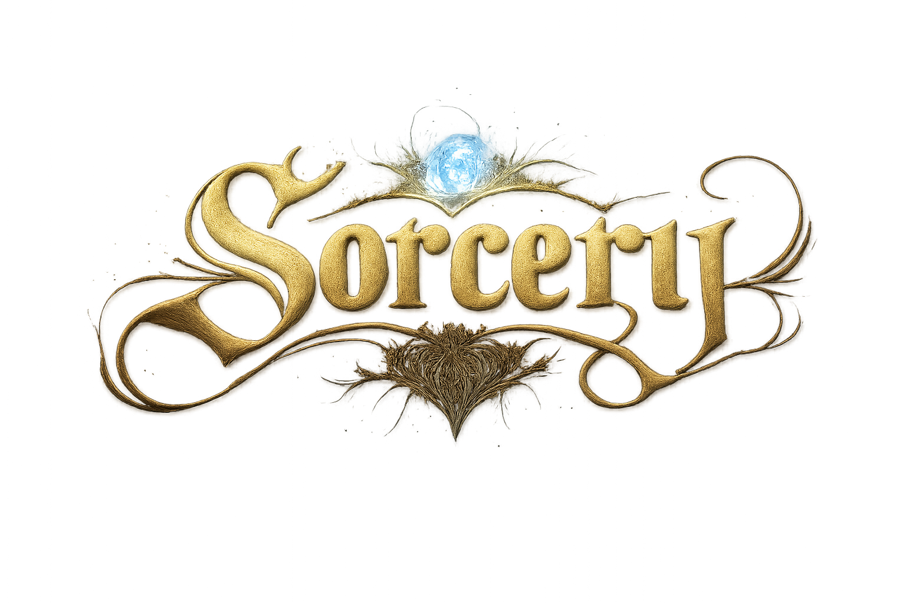

<p align="center">
  
</p>

<h3 align="center">Compress intent into spells.<br>Let lesser minds invoke them flawlessly.</h3>

<p align="center">
  <em>A notation for transmitting architectural wisdom across the context gap.</em>
</p>

<p align="center">
  <a href="#the-problem">The Problem</a> •
  <a href="#the-solution">The Solution</a> •
  <a href="#quick-start">Quick Start</a> •
  <a href="#how-it-works">How It Works</a> •
  <a href="#examples">Examples</a> •
  <a href="#get-started">Get Started</a>
</p>

---

> **Note:** Sorcery is a *design doctrine* for architecture handoff—not a framework, language, or product. It encodes intent so it survives transmission. It is not code stenography or a byte-for-byte recorder; implementation details may differ while contracts and constraints are preserved.

---

## ⚡ The Problem

You've mapped the territory. You understand the tradeoffs. The architecture lives in your head, fully formed.

Then you hand it off—and watch it dissolve:

- ◆ Agents hallucinate where you were precise
- ◆ Apprentices miss the constraints you thought were obvious  
- ◆ Future-you inherits a codebase with no memory of why

**Intent evaporates at the boundary.** Deep constraints, non-obvious tradeoffs, and hard-won decisions vanish into narrative fog.

**Context is the scarcest resource in software.** And handoff destroys it.

---

## ✦ The Solution

**Sorcery** is a notation for binding intent into transmissible form.

- **Cast:** Compress high-context reasoning into a spell—terse, complete, unambiguous
- **Invoke:** Let agents expand the spell into code, tests, or docs without guessing

Think of it as enchanting your architecture so it can be wielded by anyone.

**The core idea:** *Sorcery casts high-context intent into constrained spells so lower-context agents can act correctly without shared memory.*

### A Note on Context Asymmetry

Sorcery is intentionally **downward-facing**: casting spells is a high-context planning task; invocation is a low-context execution task.

In practice, most failures show up when spells describe things loosely instead of enumerating dependencies with `>`. What isn't listed as a dependency doesn't exist.
See `examples/LESSONS_CONTEXT_ASYMMETRY.md`.

---

## ✧ Quick Start

Here is a spell that binds a tokenizer's contract:

```glyph
#Spell: Tokenize
^ Intent: produce stable, cross-platform tokens for deterministic inference

@Tokenizer
  : utf8 -> tokens
  ! deterministic
  ! locale_free
  - network
  - persistence
  ~ valid_utf8
```

**This isn't code—it's bound intent.** It declares what must hold, what is forbidden, and why—so any agent can invoke it without improvisation.

---

## ⚗️ How It Works

### The Core Asymmetry

Sorcery enforces a clean separation between those who encode intent and those who execute it:

| Phase | Who | What Happens |
|-------|-----|--------------|
| **Casting** | The architect | Bind reasoning into a spell |
| **Invocation** | Agents, apprentices | Expand the spell into artifacts |

**Casting destroys excess context.**  
**Invocation never invents missing intent.**

### Spells: Atomic Units of Intent

A **Spell** is one focused capability, bound tight:

- **Intent** — The "why" that survives all tradeoffs
- **Guarantees** — What must *always* hold
- **Assumptions** — What the spell relies upon
- **Exclusions** — What is *forbidden* (often the most important part)

Every spell does **exactly one thing**. No bloat, no ambiguity.

### Glyph: The Shorthand Language

**Glyph** is Sorcery's symbolic notation—designed for machines, readable by humans:

| Symbol | Meaning | Example |
|:------:|---------|---------|
| `#` | Spell name | `#Spell: Tokenize` |
| `^` | Intent (required!) | `^ produce stable tokens` |
| `@` | Component/Entity | `@Tokenizer` |
| `:` | Input → Output | `: utf8 -> tokens` |
| `!` | Guarantee | `! deterministic` |
| `~` | Assumption | `~ valid_utf8` |
| `-` | Exclusion | `- network` |
| `>` | Dependency | `> @Tokenizer` |
| `?` | Open question | `? performance reqs` |

**Why symbols?** Prose is ambiguous. Glyphs enforce structure. Agents parse them cleanly.

### Slice Gating: The Seal of Completion

A spell cannot be invoked until it is **sealed**:

- ◆ Intent declared
- ◆ No open questions (`?`) remain
- ◆ Guarantees made explicit
- ◆ At least one exclusion stated
- ◆ Does exactly one thing

**A malformed spell cannot be cast.** This is quality by constraint.

---

## ◈ Examples

### Basic Spell: Tokenization

```glyph
#Spell: Tokenize
^ Intent: produce stable, cross-platform tokens to enable deterministic inference and caching

@Tokenizer
  : utf8 -> tokens
  ! deterministic
  ! locale_free
  - network
  - persistence
  ~ valid_utf8
```

**What it binds:**
- ◆ What it does (utf8 → tokens)
- ◆ Why it exists (deterministic inference)
- ◆ What must hold (deterministic, locale-free)
- ◆ What it forbids (network, persistence)
- ◆ What it assumes (valid utf8)

### Composed Spells: Building Systems

```glyph
#Spell: Parse
^ Intent: build stable syntax tree for semantic analysis

@Parser
  : tokens -> ast
  > @Tokenizer  # depends on Tokenize spell
  ! no_side_effects
  - io
  ~ valid_token_stream
```

Spells compose through **explicit contracts**—no hidden dependencies, no implied knowledge.

### Advanced: Multi-Entity Spell

```glyph
#Spell: InferenceABI
^ Intent: define stable contract boundary for model inference that survives version changes

@InferenceEndpoint
  : request -> response
  ! version_tagged
  ! backward_compatible
  - streaming
  ~ authenticated_caller

@RequestSchema
  : json -> validated_input
  ! schema_versioned
  - unknown_fields

@ResponseSchema
  : inference_result -> json
  ! deterministic_serialization
  - stack_traces
```

**See the full examples in** [`examples/`](examples/)

### Provenance (Examples vs Doctrine)

The case studies in `examples/` were largely produced around commit `d114aee`.

A later doctrine clarification tightened `>` to mean dependency (requires) and added a small dependency-pattern primer at commit `7182854`.

If you are reproducing results or writing new spells, use the current doctrine; treat older examples as historical artifacts of the experiment timeline.

---

## ⚔️ Why This Works

### Negative Space Matters

**What you forbid is as important as what you allow.**

Exclusions are first-class. A spell without them is probably incomplete.

### Boundary with Testing

| Layer | Job |
|-------|-----|
| **Sorcery** | Defines *what must be true* |
| **Tests** | Ensures *it stays true* |

Spells drive tests. Tests don't define spells.

### The Philosophy

```
Compression     over  Verbosity
Constraints     over  Explanation
Interfaces      over  Narrative
Explicit forbid over  Implied scope
Artifacts       over  Memory
```

**The canonical rule:** *Write spells that declare exactly what must happen and what must never happen—so any agent can invoke them without guessing.*

---

## 🔮 The Grammar is Complete

Nine symbols. No more needed.

Every architectural concept—wrapper metadata, optional behaviors, library variants, language semantics, regex precision—maps to existing glyphs. The temptation to add new symbols is a sign you haven't found the right incantation yet.

### ◆ Symbols vs. Vocabulary

```
Symbols      = Grammar   (fixed, nine total)
Values       = Vocabulary (infinite, domain-specific)
Incantations = Sentences  (grammar + vocabulary combined)
```

English doesn't add new grammar to express new ideas. It combines existing grammar with new vocabulary. Sorcery works the same way.

### ◆ The Incantation Table

| Concept | Symbol | Example |
|---------|--------|---------|
| Wrapper preserves function name | `!` | `! preserves_function_name` |
| Wrapper preserves arity | `!` | `! preserves_function_length` |
| Optional enhancement | `@` | Separate `@Extension` component |
| Feature explicitly excluded | `-` | `- auto_installed` |
| Library variant | `>` | `@ES6Equal > @Equal` |
| Regex allows decimals | `!` | `! allows_decimal_values` |
| Relies on language semantics | `~` | `~ set_uses_reference_equality` |
| Runtime behavior assumed | `~` | `~ objects_are_plain` |

### ◆ Incantation Patterns

**Preserving identity through wrappers:**
```glyph
@Wrapper
  ! preserves_function_name
  ! preserves_function_length
  - exposes_internal_state
```

**Separating core from optional:**
```glyph
@Core
  : fn -> wrapped_fn
  ! executes_once

@Extension
  > @Core
  ! adds_prototype_method
  - auto_installed
```

**Expressing variants:**
```glyph
@Equal
  : (a, b) -> boolean
  ! handles_objects
  - handles_Map

@ES6Equal
  > @Equal
  ! handles_Map
  ! handles_Set
```

**Declaring runtime assumptions:**
```glyph
@SetCompare
  : (a, b) -> boolean
  ~ set_has_uses_reference_equality
  ~ objects_not_deep_compared_inside_sets
```

### ◆ Finding the Right Incantation

When a concept seems inexpressible, ask:

| Question | Symbol |
|----------|--------|
| Must this always hold? | `!` guarantee |
| Must this never happen? | `-` exclusion |
| Do we rely on this being true? | `~` assumption |
| Is this a distinct piece? | `@` component |
| Does this extend something else? | `>` dependency |

One of these fits. Always.

### ◆ The Reframe

When stuck:

> ✗ "Sorcery cannot express X"

Becomes:

> ✓ "What combination of `#^@:!~->?` encodes X?"

The answer exists. The grammar is closed. The vocabulary is yours.

---

## ⚡ Begin

1. **Choose a component** that keeps breaking or drifting
2. **Name the intent** — the "why" that must survive all tradeoffs
3. **Declare guarantees, assumptions, exclusions**
4. **Hand the spell to an agent** for invocation

**Start with one spell.** See what survives.

### Repository Structure

```
sorcery/
├── README.md           # This guide
├── examples/           # Spell examples
│   ├── tokenize.spell
│   ├── parse.spell
│   └── inference_abi.spell
├── LICENSE             # MIT
└── sorcery-logo.png    # Because why not?
```

### Contributing

Found a better incantation? Want to sharpen the doctrine? Open an issue or PR.

---

<p align="center">
  <strong>Sorcery — because intent deserves to survive transmission.</strong>
</p>

<p align="center">
  <sub>A design doctrine. Not magic—disciplined compression.</sub>
</p>
